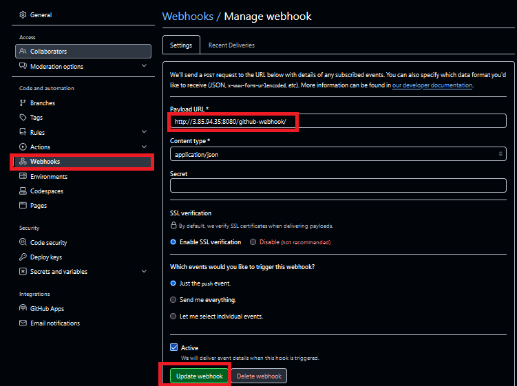

# AUTOMATING DEPLOYMENT OF AN E-COMMERCE WEBSITE

The goal is to achieve continuos integration, continuos deployment and ensure the scalability and reliability of an E-Commerce website. 

## CICD MASTERY

## Project Scenario

A technology consulting firm is is adopting a cloud architechture for its software business. As a DevOps engineer, your task is to design and to implement a robust CI/CD pipeline using Jenkins to automate the deployment of a web application. The goal is to achieve continous integration continous deployment. and ensure scalability and reliability of the applications.

## Prerequisites

1. **Jenkins Server**: Jenkins is installed on a dedicated server or VM.

2. **Target Server**: A server where your containerized application will run.

3. **Git Repository**: Your application’s code is hosted in a Git repository (e.g., GitHub, GitLab).

4. **Docker Registry**: A Docker registry (e.g., Docker Hub, Amazon ECR) where Docker images will be stored.

5. **SSH Access**: Jenkins must have SSH access to the target server.

### Components

**1. Jenkins Server Setup**

**Objective:** Configure Jenkins pipeline for CICD automation.

**Steps:**
- Install Jenkins on a dedicated server


- Setup neccessary plugins (Git, Docker, etc)


- Configure Jenkins credentials


### Docker Credentials


### Git Credentials


### SSH Credentials for the application server


### Configured Credentials


## Containerize Your Application

### Create a Dockerfile :

We are using Nginx Dockerfile for this project

**Step 1**: Set Up Your Project Directory

1. Create a Project Directory:

- On your local machine, create a new directory for your project.

```
mkdir nginx-app
cd nginx-app
```


2. Add Your Website Files:

- Inside the project directory, create a html folder to hold your static website files (e.g., HTML, CSS, JavaScript).

`mkdir html`


- Add your website files (e.g., index.html, style.css) inside the html directory.


**Step 2**: Create the Nginx Dockerfile

1. Create a Dockerfile:

- In the root of your project directory (where the html folder is located), create a file named Dockerfile.

`touch Dockerfile`


2. Write the Dockerfile:

- Open the Dockerfile in a text editor and add the following content:

```
# Use the official Nginx image from Docker Hub
FROM nginx:latest

# Remove the default Nginx website
RUN rm -rf /usr/share/nginx/html/*

# Copy the static website files from the local html directory to the Nginx directory
COPY html /usr/share/nginx/html

# Expose port 80 for the Nginx server
EXPOSE 80

# Start Nginx
CMD ["nginx", "-g", "daemon off;"]
```

**Explanation:**

FROM nginx:latest: Uses the official Nginx Docker image as the base.

RUN rm -rf /usr/share/nginx/html/*: Removes the default files served by Nginx.

COPY html /usr/share/nginx/html: Copies your static website files into the Nginx directory.

EXPOSE 80: Exposes port 80, which is the default HTTP port for Nginx.

CMD ["nginx", "-g", "daemon off;"]: Runs Nginx in the foreground (needed for Docker containers).


**Step 3**: Build and Test the Nginx Docker Image

1. Build the Docker Image:
- Run the following command in your terminal to build the Docker image:

`docker build -t nginx-app .`

- This will create a Docker image named nginx-app using the Dockerfile you created.


2. Run the Docker Container:

- Run a container from the image to test it:

`docker run -d -p 8081:80 nginx-app`

- This maps port 8081 on your local machine to port 80 in the container. 

**Note**: Port 8081 was chosen because the default port 8080 for Nginx was already in use.


3. Test the Application:

- Open a web browser and go to http://localhost:8081.

- You should see your static website served by Nginx.


**Step 4**: Push the Docker Image to a Registry (Optional)

If you want to use this image in a CI/CD pipeline or deploy it on a server, you'll need to push it to a Docker registry.

1. Tag the Docker Image:

Tag the image for your Docker registry (e.g., Docker Hub, Amazon ECR):

`docker tag nginx-app olayinkabo2/nginx-app:v1`


2. Push the Image to the Registry:

- Push the tagged image to your Docker registry:

`docker push olayinkakabo2/nginx-app:v1`


3. Use the Image in Deployment:

 You can now use this image in your Jenkins pipeline or deploy it on any Docker-supported platform.

**Step 5**: Use in Jenkins Pipeline (Optional)

If you are integrating this with Jenkins, the pipeline stages for building, pushing, and deploying this Nginx-based application would be as below:

```
pipeline {
    agent any
    environment {
        DOCKER_REGISTRY = 'your-docker-registry-url'
        IMAGE_NAME = 'nginx-app'
        TARGET_SERVER = 'your-target-server-ip'
        SSH_CREDENTIALS_ID = 'target-server-ssh'
    }
    stages {
        stage('Checkout') {
            steps {
                git(credentialsId: 'git-credentials', url: 'https://github.com/your-repo.git')
            }
        }
        stage('Docker Build') {
            steps {
                script {
                    docker.build("${DOCKER_REGISTRY}/${IMAGE_NAME}:${env.BUILD_ID}")
                }
            }
        }
        stage('Push to Registry') {
            steps {
                script {
                    docker.withRegistry('', 'docker-registry-credentials') {
                        docker.image("${DOCKER_REGISTRY}/${IMAGE_NAME}:${env.BUILD_ID}").push()
                    }
                }
            }
        }
        stage('Deploy to Server') {
            steps {
                script {
                    sshagent([SSH_CREDENTIALS_ID]) {
                        sh """
                        ssh -o StrictHostKeyChecking=no user@${TARGET_SERVER} \\
                        'docker pull ${DOCKER_REGISTRY}/${IMAGE_NAME}:${env.BUILD_ID} && \\
                        docker stop ${IMAGE_NAME} || true && \\
                        docker rm ${IMAGE_NAME} || true && \\
                        docker run -d --name ${IMAGE_NAME} -p 80:80 ${DOCKER_REGISTRY}/${IMAGE_NAME}:${env.BUILD_ID}'
                        """
                    }
                }
            }
        }
    }
    post {
        always {
            cleanWs()
        }
    }
}
```

### Configure Jenkins to automate the Deployment of the Website

1. On Jenkins dashboard, select 'New Item'


- Choose Pipeline 


In the general section, Check Github project and provide project url/


Under Build Triggers, check GitHub hook trigger for GITScm polling.

In Pipeline section, choose pipeline script from SCM


### Source code management Repository Integration

#### Create source code

- Create Jenkinsfile 

```
pipeline {
    agent any
    environment {
        DOCKER_REGISTRY = 'olayinkabo2' // DockerHub username
        IMAGE_NAME = 'nginx-app'
        TARGET_SERVER = '54.166.0.229'
        SSH_CREDENTIALS_ID = 'application-server-ssh'
    }

    stages {
        stage('Checkout') {
            steps {
                git branch: 'main', 
                    credentialsId: 'git-credentials', 
                    url: 'https://github.com/OlayinkaBo/Automating-Deploymemt-of-an-E-Commerce-Website.git'
            }
        }

        stage('Docker Build') {
            steps {
                script {
                    // Specify the correct path to the Dockerfile in the nginx-app directory
                    docker.build("${DOCKER_REGISTRY}/${IMAGE_NAME}:${env.BUILD_ID}", "-f nginx-app/Dockerfile .")
                }
            }
        }

        stage('Push to Registry') {
            steps {
                script {
                    docker.withRegistry('', 'docker-registry-credentials') {
                        docker.image("${DOCKER_REGISTRY}/${IMAGE_NAME}:${env.BUILD_ID}").push()
                    }
                }
            }
        }

        stage('Deploy to Server') {
            steps {
                script {
                    sshagent([SSH_CREDENTIALS_ID]) {
                        sh """
                        ssh -o StrictHostKeyChecking=no ubuntu@${TARGET_SERVER} \\
                        'docker pull ${DOCKER_REGISTRY}/${IMAGE_NAME}:${env.BUILD_ID} && \\
                        docker stop ${IMAGE_NAME} || true && \\
                        docker rm ${IMAGE_NAME} || true && \\
                        docker run -d --name ${IMAGE_NAME} -p 80:80 ${DOCKER_REGISTRY}/${IMAGE_NAME}:${env.BUILD_ID}'
                        """
                    }
                }
            }
        }
    }

    post {
        always {
            cleanWs()
        }
    }
}


```


#### Manage source code on the version control system

Connect Jenkins to a version control system e.g Github for source code management.

- Integrate Jenkins with source code management repository

- Configure webhooks for automatic triggering of Jenkins build.





### Run the Jenkins Pipeline

1. Trigger the Pipeline:
   - Manually trigger the pipeline or set up a webhook to trigger it on code commits.

   

2. Monitor the Pipeline:
   - Monitor each stage in Jenkins (checkout, build, test, Docker build, push, deploy) for successful completion.

   

3. Verify Deployment:
   - Once the pipeline completes, access the application via the target server's IP or domain.


# Summary

By following this process, you can deploy your containerized application. Jenkins will handle the CI/CD pipeline, building and pushing Docker images, and deploying them directly to your target servers via SSH. 


